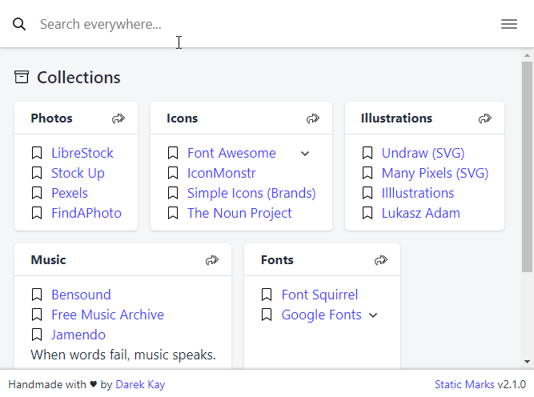

# Static Marks

[](https://travis-ci.com/darekkay/static-marks) [](https://www.npmjs.com/package/static-marks) [](https://github.com/darekkay/static-marks/blob/master/LICENSE)

<div align="center" class="text-center">

Convert your **plain bookmark** files into a **static web app**.


</div>

- **Share** your bookmarks app via a single HTML file.
- It's **free** and [open source](https://github.com/darekkay/static-marks).
- Browser-independent.
- **Import** bookmarks from Chrome, Firefox or Pocket.

🔖 [**View Live Demo**](https://darekkay.com/static-marks/demo/default.html)

## Demo

<div align="center" class="text-center">



</div>

## Quickstart

- Install Static Marks:

```bash
npm install -g static-marks
```

- Convert your (exported) browser bookmarks to YAML:

```bash
static-marks import browser-bookmarks.html > bookmarks.yml
```

- Generate your bookmarks app:

```bash
static-marks build bookmarks.yml > bookmarks.html
```

## Installation

- As a globally available CLI tool:

```bash
npm install -g static-marks
```

- As a local dependency in your project:

```bash
npm install --save static-marks
```

- As a [docker container](https://github.com/gaerfield/static-marks-docker) (unofficial).

## Usage

```
static-marks [options] <command>

Options:
  -V, --version               output the version number
  -h, --help                  output usage information

Commands:
  build [options] <files...>  build bookmarks app
  import [options] <file>     import bookmarks from chrome, firefox or pocket
```

Run `static-marks <command> --help` to view the usage of a specific command.

### Build bookmarks app

```
static-marks build [options] <files...>

Options:
  -o, --output [file]     output to a file (use stdout by default)
  -t, --title [title]     set document title
  --template-file [file]  use a custom web page template
```

Examples:

```bash
static-marks build bookmarks.yml > bookmarks.html  # Single file
static-marks build -o bookmarks.html bookmark.yml  # Alt. notation
static-marks build f1.yml f2.yml > bookmarks.html  # Multiple files
static-marks build files/* > bookmarks.html        # All files at path
```

### Import bookmarks

```
static-marks import [options] <file>

Options:
  -o, --output [file]  output to a file (use stdout by default)
```

Examples:

```bash
static-marks import exported.html > imported.yml
```

## Features

- Use custom browser search engines with a `?search=%s` URL param ([example](https://darekkay.com/static-marks/demo/default.html?search=fire)).
- Use custom web page templates. If you don't like the default UI, provide your own ([example](https://darekkay.com/static-marks/demo/custom.html) based on [this template](https://github.com/darekkay/static-marks/blob/master/docs/examples/templates/custom.html)).

## File format

Bookmark files are written in [YAML](http://yaml.org). There are multiple levels of hierarchy:

```yaml
Collection:
  - Bucket:
    - Link: https://example.com
```

A link URL can be expressed either as an item property or as a child item:

```yaml
- Link 1: https://example.com
- Link 2:
  - https://example.com
```

Notes and nested links are added as children of a link (the first element is the link URL):

```yaml
- Link with notes:
  - https://example.com
  - This is a text note
  - Link note: https://example.com</pre>
```

First-level notes can be used to describe or structure a bucket:

```yaml
- Bucket:
  - Link 1: https://example.com
  - Carpe diem!
```


Here's a complete example:

```yaml
Collection:
  - Bucket:
    - Link 1: https://example.com
    - Link 2:
      - https://example.com
    - Link with notes:
      - https://example.com
      - This is a text note
      - Link note: https://example.com</pre>
    - First-level note
```

If multiple files are provided to `static-marks`, they will become selectable via a menu.

## Development and Contribution

The frontend part of Static Mark is maintained in [another repository](https://github.com/darekkay/static-marks-app), where a template file (`_template.html`) is being generated. This approach makes it possible to include the whole application and user-defined bookmarks in a single HTML file.

If you want to provide any frontend-related changes, please create a PR in the other repository. Changes to the core CLI application are handled here instead.

## License

Copyright 2020 Darek Kay <hello@darekkay.com>

This project and its contents are open source under the [MIT license](https://github.com/darekkay/static-marks/blob/master/LICENSE).
